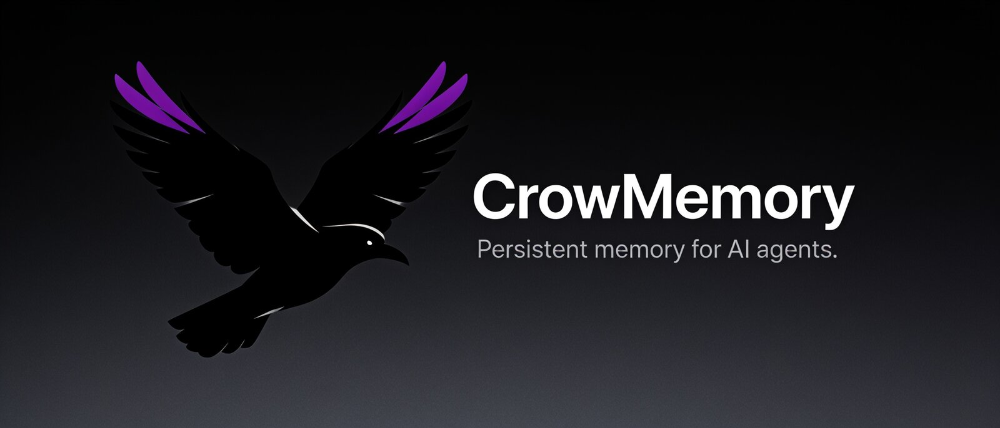

# CrowMemory MCP

Persistent memory for AI agents. Works with any MCP-compatible client — Claude Code, Zed, Cursor, Windsurf, Claude Desktop, and more.

**[Download the latest release](https://github.com/tchebit/crowmemory-releases/releases)**

---

## What it does

CrowMemory gives AI agents long-term memory that persists across sessions, projects, and tools. Agents remember what they learned, what they decided, and why — without you managing anything.

## Capabilities

| Capability | Description |
|---|---|
| **Semantic Memory** | Store and recall context using vector similarity search |
| **Hybrid Search** | Unfiltered queries combine semantic and keyword search; a query filtered by type or tag is vector-only (Pro) |
| **Knowledge Graph** | Link related memories into navigable decision trails |
| **Handoff Channels** | Hand ephemeral tasks between agents (and humans) — queue or broadcast, isolated from search |
| **Agent Profiles** | Save and activate reusable agent personas across sessions |
| **Pinned Memories** | Mark memories as always-on context, loaded explicitly via `get_pinned` |
| **Memory Lifecycle** | Archive (soft delete), pin, and manage memory over time |
| **Temporal Queries** | Ask for memories by time — "yesterday", "last session", "before March" |
| **Pair Sync** | Share encrypted context with teammates via secure relay (Pro) |
| **Audit & Traceability** | Full observability into every AI memory operation (Pro) |
| **Tag & Type Filtering** | Organize memories by type (decision, bug, task, question) and custom tags |
| **Credential Guardrail** | The agent is instructed never to store secrets, and to reference them by location instead. Advisory: nothing scans or blocks what you store |
| **Handoff from a shell** | Push, claim and complete handoffs with the `handoff` command — for scripts, timers, and agents that do not speak MCP |
| **Wake an idle agent** | A background watcher starts the agent you configured when a handoff has been waiting, so work does not sit until someone happens to look |
| **Verify your install** | `crow-memory-mcp verify` checks the documented guarantees against the binary you have and tells you which ones held |

## New in 0.4.0

**Handoffs work outside MCP.** `crow-memory-mcp handoff push|pop|ack|nack|read|channels`
gives a script, a timer, or an agent that does not speak MCP the same queue the
MCP tools use — with exit codes and `--json` so nothing has to parse prose.

**An idle agent can be woken.** A handoff used to sit until somebody happened to
look. `crow-memory-mcp watch` starts the agent you configured when work has been
waiting, and installs itself into systemd, launchd or Task Scheduler with
`watch --install`. It only ever wakes an agent you have explicitly marked as safe
to run unattended, and it tells that agent it was started automatically, so a
handoff is treated as a request to check rather than as authorisation.

**Session hooks for Gemini CLI and Codex**, alongside Claude Code, and
`install-hooks --global` to cover every project at once.

**You can check the guarantees instead of trusting them.**
`crow-memory-mcp verify` runs the documented handoff rules against your own
binary and reports which held. The documentation now also separates what is
*enforced* — the tool will not let you break it — from what is *advisory*, which
is exactly the distinction that is invisible in prose and expensive to learn by
experiment.

**Long memories say when they are too long.** Storing text past the model's
indexing window now warns and reports how much of it is searchable, instead of
accepting it silently. Everything is still stored and returned in full; only
meaning-based search is affected.

**Duplicate detection no longer suggests deleting the wrong thing.** Two long
memories that begin alike are compared in full before either is called a
duplicate, and a pair that merely shares an opening is reported without any
suggestion to remove one.

### Fixes worth knowing about

- Searching with a type or tag filter now returns every match, rather than only
  those that happened to rank highly for the query. On a large brain this could
  return almost nothing.
- Two agents sharing one brain can no longer overwrite each other's memories.
- A running agent now picks up memories written by another agent as they arrive.
- Starting two agents against the same brain at the same moment no longer risks
  one of them failing to start.
- Handoffs record which agent released a claim, so abandoned work says who left
  it.

## Editions

| | Free | Pro | Teams |
|---|---|---|---|
| Semantic memory + knowledge graph | Yes | Yes | Yes |
| Shared memory across agents | Yes | Yes | Yes |
| Pinned memories (`pin_memory`, `get_pinned`) | Yes | Yes | Yes |
| Handoff Channels (agent-to-agent relay) | Yes | Yes | Yes |
| Handoff CLI, wake daemon, `verify` | Yes | Yes | Yes |
| Hybrid search (semantic + keyword) | — | Yes | Yes |
| Pair Sync (encrypted sharing) | — | Yes | Yes |
| Audit & traceability | — | Yes | Yes |
| All MCP tools | — | Yes | Yes |
| Team brain sync | — | — | Yes |

**Free** — download below. **Pro & Teams** — [crowmemory.ai](https://crowmemory.ai)

## Audit & Traceability (Pro / Teams)

Every memory operation — store, recall, delete, update, archive, link, sync — produces a structured JSONL event with full context: who, what, when, and which project. Stream these events to **your own infrastructure** — any HTTP endpoint, SIEM, logging pipeline, or local binary collector.

**You control the data.** CrowMemory does not phone home. Events go where you configure them — your servers, your collectors, your rules.

```toml
# Example: stream events to your logging infrastructure
[tracking]
level = "info"
exclude_events = ["memory.recalled"]  # optional filtering

[tracking.remote]
url = "https://your-logging-server.com/ingest"
authorization = "Bearer your-token"
headers = { "X-Team" = "engineering", "X-Env" = "production" }
batch_size = 10
flush_interval_ms = 5000

[tracking.local]
command = "/usr/local/bin/your-collector"
args = ["--format", "json"]
```

**Use cases:**
- **AI usage metrics** — measure how agents use memory across teams and projects
- **Compliance auditing** — prove what AI agents stored, recalled, and deleted
- **Cost attribution** — track memory operations per team, project, or session
- **Incident forensics** — trace exactly what an agent knew and when

## Quick Start

### macOS / Linux (Homebrew)

```bash
brew tap tchebit/crowmemory
brew install crow-memory-mcp
```

Then add it to your MCP client — see [Install on Claude](#install-on-claude) below, or the docs for Zed, Cursor, Windsurf, etc.

### Manual download (all platforms, incl. Windows)

1. Download the binary for your platform from [Releases](https://github.com/tchebit/crowmemory-releases/releases)
2. Make it executable: `chmod +x crow-memory-mcp-free-*`
3. Move to your PATH: `sudo mv crow-memory-mcp-free-* /usr/local/bin/crow-memory-mcp`
4. Add it to your MCP client — see [Install on Claude](#install-on-claude) below, or the docs for Zed, Cursor, Windsurf, etc.

## Install on Claude

CrowMemory works with both Claude Code (CLI/IDE) and Claude Desktop. Pick the one you use — you can add it to both, they share the same local memory brain.

### Claude Code

Run once, from anywhere:

```bash
claude mcp add -s user crow-memory -- crow-memory-mcp
```

- `-s user` registers it for every project (drop it, or use `-s project`, to scope it to the current project instead).
- Verify it's connected: `claude mcp list` should show `crow-memory` as `connected`.
- Restart any running `claude` sessions to pick it up.

To use the Pro/Teams binary instead, point the same command at that binary's path (e.g. `-- /usr/local/bin/crow-memory-mcp-pro --enable-fts5`).

### Claude Desktop

Claude Desktop reads its MCP server list from a config file:

| OS | Path |
|---|---|
| macOS | `~/Library/Application Support/Claude/claude_desktop_config.json` |
| Windows | `%APPDATA%\Claude\claude_desktop_config.json` |
| Linux | `~/.config/Claude/claude_desktop_config.json` |

Create the file if it doesn't exist, and add (or merge into) the `mcpServers` block:

```json
{
  "mcpServers": {
    "crow-memory": {
      "command": "/usr/local/bin/crow-memory-mcp"
    }
  }
}
```

If the binary isn't on your `PATH`, use its full path in `command`. For the Pro/Teams binary, add the flag it needs:

```json
{
  "mcpServers": {
    "crow-memory": {
      "command": "/usr/local/bin/crow-memory-mcp-pro",
      "args": ["--enable-fts5"]
    }
  }
}
```

Restart Claude Desktop completely (quit, not just close the window) for the new server to load. You should see `crow-memory` listed under the MCP/plugin icon in a new chat.

## Claude Code: Hand Work From One Session to the Next

Stop work in one session, start another an hour later, and everything the first
one learned is gone. One command wires that up:

```bash
crow-memory-mcp install-hooks
```

Run it once per project. From then on, ending a session writes a handoff, and the
next session in that project is given it **before its first prompt** — no tool
call, no prompting, nothing to remember.

What it hands over is facts, not a generated summary: the memories that session
stored, the last thing you actually asked, and the files it touched. The memories
are the substance — they are pointers resolved live when the next session reads
them, so the handoff cannot go stale.

Details worth knowing:

- It merges into `.claude/settings.json`, keeps hooks you already have, and is
  safe to re-run. It refuses to touch a settings file whose JSON it can't parse.
- A session that stored nothing, touched nothing and was asked nothing hands over
  **nothing** — a block that is usually noise teaches the next session to ignore
  it.
- The hooks don't load the embedding model, so they add no startup cost.
- Free edition, fully local.

This is independent of the pinned-memory hook below; both can be installed, and
they answer different questions — *what always matters* versus *what just
happened*.

## Claude Code: Auto-load Pinned Memories on Session Start

`get_pinned` is not injected into `recall` results — it only surfaces pinned context when called explicitly. Claude Code also drops conversation state on `/compact`, `/resume`, and `/clear`, so wiring `get_pinned` into a `SessionStart` hook keeps your agent oriented at every one of those points, not just at first launch. This works on **every edition** — `pin_memory` (pass `pinned: false` to unpin) and `get_pinned` are both free-tier tools.

### 1. Create the hook script

Save this as `~/.claude/hooks/crow-memory-recall.sh` (user-level, applies to all projects) or `.claude/hooks/crow-memory-recall.sh` (project-level):

```bash
#!/usr/bin/env bash
# SessionStart hook — injected into context on startup / resume / compact / clear.
cat <<'MSG'
[crow-memory protocol] Before doing anything else:
1. Call mcp__crow-memory__get_pinned — load pinned context (architecture, conventions, must-know facts).
2. Before implementing or answering about prior work, call mcp__crow-memory__recall
   with project-specific keywords (on Pro/Teams an unfiltered query also matches keywords;
   filtering by type or tag makes it vector-only).
3. After completing a unit of work, store it with mcp__crow-memory__remember
   (with memory_type/tags/priority) and link_memories to related entries.
Do not ask whether to checkpoint — follow this protocol.
MSG
```

Make it executable:

```bash
chmod +x ~/.claude/hooks/crow-memory-recall.sh
```

### 2. Register the hook

Add to `~/.claude/settings.json` (user-level) or `.claude/settings.json` (project-level, checked into the repo so it applies to every contributor):

```json
{
  "hooks": {
    "SessionStart": [
      {
        "matcher": "startup|resume|compact|clear",
        "hooks": [
          {
            "type": "command",
            "command": "bash ~/.claude/hooks/crow-memory-recall.sh"
          }
        ]
      }
    ]
  }
}
```

Use a repo-relative path (e.g. `bash .claude/hooks/crow-memory-recall.sh`) instead if the hook script is checked into the project rather than kept at the user level.

### 3. Pin what matters

```
pin_memory(memory_id: "...")   # mark architecture decisions, conventions, must-know context
get_pinned()                    # verify what's loaded
```

Keep the pin list to a curated shortlist — critical guardrails and conventions, not a dump of everything you've ever stored.

## Skills

The MCP server gives an agent the memory *tools*. A skill teaches it when and how
to use them — search before answering, pick the right `memory_type`, link related
memories into a trail rather than leaving them as a flat pile. Optional, but the
difference is large enough that it's worth the two minutes.

Two ship here, matching the editions:

| Skill | For |
|---|---|
| [`crow-memory-free`](./skills/crow-memory-free) | Free edition — the memory tools, the knowledge graph, handoff channels |
| [`crow-memory-pro`](./skills/crow-memory-pro) | Pro / Teams — adds hybrid search and encrypted pair sync |

A third, **crow-memory-handoff**, is not listed here because you don't install it
by hand: `crow-memory-mcp init` writes it into `.claude/skills/` for you. It ships
inside the server binary and covers handoff channels in full — leases, ack/nack,
addressing. Because it is versioned with the server, it can't drift out of step
with the tool surface, so trust it over the summaries in the skills above if the
two ever disagree.

### Install into Claude Code

Skills live in a folder named after the skill, containing a `SKILL.md`. Pick a
scope:

| Scope | Path | Applies to |
|---|---|---|
| Personal | `~/.claude/skills/<name>/SKILL.md` | every project you work on |
| Project | `.claude/skills/<name>/SKILL.md` | that repo only — commit it, and your team gets it |

Personal install, Free edition:

```bash
mkdir -p ~/.claude/skills/crow-memory-free
curl -fsSL https://raw.githubusercontent.com/tchebit/crowmemory-releases/master/skills/crow-memory-free/SKILL.md \
  -o ~/.claude/skills/crow-memory-free/SKILL.md
```

Pro / Teams — same thing, swap the name:

```bash
mkdir -p ~/.claude/skills/crow-memory-pro
curl -fsSL https://raw.githubusercontent.com/tchebit/crowmemory-releases/master/skills/crow-memory-pro/SKILL.md \
  -o ~/.claude/skills/crow-memory-pro/SKILL.md
```

Project-scoped instead — run it from the repo root and use `.claude/skills/` in
place of `~/.claude/skills/`.

Restart `claude`, then run `/skills` to confirm it's listed. You don't invoke it
by hand: Claude reads the `description` in the frontmatter and loads the skill
itself when the work calls for it.

### Install into Claude Desktop

Claude Desktop has no skills folder. Paste the body of `SKILL.md` (everything
below the `---` frontmatter block) into your project instructions instead.

### Contribute one

Skills are reusable prompt patterns — code review, bug triage, onboarding, an
architecture log. Open a PR; see [`skills/CONTRIBUTING.md`](./skills/CONTRIBUTING.md)
for the format.

## Links

- [Releases](https://github.com/tchebit/crowmemory-releases/releases)
- [Homebrew tap](https://github.com/tchebit/homebrew-crowmemory)
- [Website](https://crowmemory.ai)
- [Report Issues](https://github.com/tchebit/crowmemory-releases/issues)
